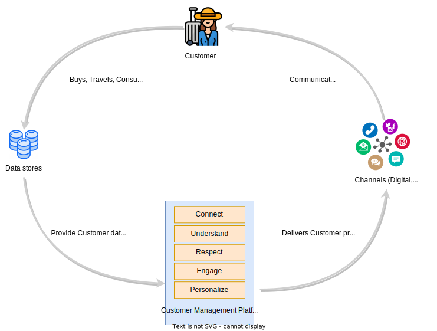

[> Home](../README.md)
| [Next >](../2.architecture_analysis/README.md)

---

# Context & Motivation
Gamma airways is a rapidly growing Airline based in the Europe. It flies to over 130 destinations worldwide and is looking to expand its operations further. 
Due to the digital age and growing demands from customer's for a brands presence through digital channels, it is striving hard to improve the customer experience to generate more revenue, enhance customer satisfaction and to increase customer retention. However it is facing the below challenges and problems in the current state from a business perspective

1. The Customers feel that personalized attention and experience is lacking when they interact with the Customer service touchpoints
2. The Service Agents feel that they do not get a 360 deg view of the Customer including their profile, past interactions and their loyalty to the brand which leads to a less than satisfactory experience for the Customer and the Service Agents are unable to delight the customers

Given the current state & global regulatory constraints related to Collection, handling and disposing of Customer Personal data, the airline is looking to do the below to address the Customers & Service agent concerns .

1. Provide a personalized service to its customers at all its touchpoints (channels of interaction both digital & service touchpoints)
2. Empower the Service agents to delight the Customers by providing a real-time 360 degree view of customer they are serving with Intelligent decision support capability. 

## Problem Brief
To achieve its goal of improving the Customer experience and delighting its customers, Gamma airways senior management formulated the below business vision.

The vision is to create a comprehensive intelligent Customer Management Platform (CMP) which enables the foundation of a data-driven Customer centric organization. This platform will enable centralized management of customer information across all interaction channels (both digital & service channels). The CMP is also envisioned to provide the below high level capabilities

1. Unified Customer Profiles
2. Hyper personalisation 
3. Real time view of the Customer Journey
4. Automation for enhanced operations and customer experience
5. Intelligent & context aware recommendations to enable personalized interaction with Customers

## Stakeholder Concerns & Expectations
Below are the key stakeholders concerns and their expectations from the newly envisioned Customer Management Platform (CMP)

| Stakeholder | Concerns & Expectations |
| --- | --- |
| Customer | - Personalized connected experience across digital channels & service channels   - Personal data protection & privacy |
| Call Center agent | - Unified Customer Profile & segmentation   - Near real time view of Customer Journey & status   - Contextual recommendations & actions to proactively address customer concerns |
| Check-in agent | - Unified Customer Profile & segmentation   - Near real time view of Customer journey & status   - Contextual recommendations & actions to proactively address customer concerns   - Near real-time view of operational events and their impact on customers and corresponding recommendations per customer|
| Cabin Crew | - Unified customer profile & segmentation   - Customer preferences, choices, past interactions , complaints & travel history   - Contextual recommendations, offers & personalization |
| Partners & Service Providers | - Anonymized customer profile & segmentation |
| Data Analyst | - Self-service analytics to unearth fresh customer insights |
| Customer affairs & complaints| - Automated Case & compensation management on operational disruptions   - Near real time alerts on operational disruption events|
| Data Privacy Office | - Centralized consent management aligning to Data Privacy regulation by region   - Reliable and accurate view of Personal information stored, processed & shared to partners   - Ability to support personal data consent revocations by Customers|

In addition to the above, Marketing, Loyalty, Catering, Service delivery etc. also have similar expectations of a unified customer profile with preferences, choices & enhanced customer insights   

## Current state key challenges
Below are the key challenges observed in the Current state

1. Disconnected operational systems leading to information silos & lack of unified customer profile, resulting in operational inefficiencies
2. Lack of real-time view of the Customer journey within the organization e.g. Callcenter 
3. Customer consent is spread across different operational systems and lack of unified view of consent information across the system landscape
4. Limitations of current dataset resulting in inability to unearth fresh insights.
5. Inefficient Manual Business process e.g. Compensation  

## Business Goals
1. Increased revenue
2. Enhanced customer satisfaction and retention. 
3. Improve sales conversion rates.
4. Enhance data privacy and customer consent implementation.

## Business Drivers

1. A centralized customer profile and relationship from various customer touchpoints and systems
2. Personalization features to tailor interactions and offers to individual customers.
3. Capability to share profile data with strategic partners while preserving anonymity in compliance with privacy regulations.
4. Real time data processing and analysis to provide timely insights
5. Advanced analytics & AI capabilities to improve customer Experience
6. Hyper personalisation and feedback loop mechanism from social media
7. Automation / Manage operations by exceptions

---
[> Home](../README.md)
| [Next >](../2.architecture_analysis/README.md)

