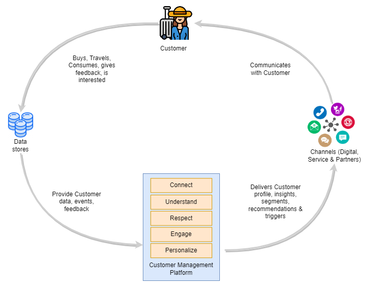

# Problem Brief
In order to achieve its goal of improving the Customer experience and delighting its customers, Gamma airways senior management forumulated the below business vision.

The vision is to create a comprehensive intelligent Customer Management Platfrom which enables the foundation of a data-driven Customer centric organization. This platform will enable to manage customer information across all interaction channels (both digital & service channels) and which provides the below high level capabilities

1. Unified & Enhanced Customer Profiles
2. Near Real time view of the Customer Journey
3. Intelligent & context aware recommendations / actions for Service channels and to enable personalized interaction with Customers