# Solution Overview
The below diagram provides a conceptual view of the proposed solution.

The customer management platform is envisioned to the below core functions for enabling a customer centric organization

## Collect Data
This involves collecting existing Customer profiles, related transactions, past journeys, interaction logs as well as customer consent across all the channels of interaction both Direct as well as Service channels. This involves integrating with existing transactional as well as analytical information sources inside the organization's system landscape as well other third party Saas solutions used by the Airline.

## Unify Profiles
Once the relevant information is collected, this information is cleaned, de-duped and aggregated with the goal of unifying the Customer profile. This involves the key step of arriving an a unified customer identity and the set of attributes which are used for uniquely identifying the Customer at each interaction touchpoint. 

Customer Identification is the foundation for unifying & enhancing customer profiles. This is a core capability of the Customer Management Platform.

The main goal of this function is to create a 360 deg, view of the customer along with their past transactions, interactions, preferences etc.

## Protect Data

## Orchestrate / Automate

## Publish Profiles

## Key capabilities of proposed solution

## Benefits of Proposed solution

blah blah blah...

## Innovations

blah blah blah...