# Solution Overview
The below diagram provides a conceptual view of the proposed solution called as Customer Management Platform (CMP).

## Key capabilities of proposed solution

The customer management platform (CMP) is envisioned to provide the below core functions for enabling a customer centric organization

### Collect
This involves collecting **existing Customer profiles, related transactions, past journeys, interaction logs** as well as **customer consent** across all the channels of interaction both Direct as well as Service channels. This involves integrating with existing transactional as well as analytical information sources inside the organization's system landscape as well other third party Saas solutions used by the Airline. This function will provide the ability to collect data in **bulk or near-real time streaming data sources**.

As per the illustration above, the CMP will integrate with the below key data / information sources,

#### Direct Channels
These are typically the Digital channels which the Customers (traveller) uses to interact directly with the Airline. This will cover the entire spectrum of touchpoints including before booking, during journey & after journey phases.

#### Service Channels
These are typically the Customer facing service channels which the Customers (traveller) interacts with during all the phases mentioned above during their Journey. For e.g. Call center & customer service channel interactions through Phone, email, IVR etc, falls under this category

#### OLTP (Online Transaction processing) & EIS (Enterprise information systems) 
These are typically backend systems which capture the transactions / interactions done throug the Direct & Service channels. For e.g Order Mgmt, Offer mgmt, Loyalty systems, Compensation management systems etc. fall under this category.

#### Partner / Service provider systems
These are typically transactional sytems used by the Airline Partners / Service providers. For eg. 3rd party catering systems, Booking systems used by Sales agencies, Chaffeur services etc.

### Unify
Once the relevant information is collected, this information is cleaned, de-duped and aggregated with the goal of unifying the Customer profile. This involves the key step of arriving an a **unified customer identity** and the set of attributes which are used for uniquely identifying the Customer at each interaction touchpoint. 

Customer Identification is the foundation for unifying & enhancing customer profiles. This is a core capability of the Customer Management Platform.The main goal of this function is to **create a 360 deg, view of the customer** along with their past transactions, interactions, preferences etc.

### Protect
Since the CMP will hold **sensitive Customer personal information**, the platform will provide the necessary **regulatory & compliance features** with respect to personal data privacy requirements.

### Orchestrate
Based on the Unified customer profile & enhanced insights the Platform will provide **automated orchestration features** such as automated compensation management , case management etc.

### Publish
The key capability of the CMP is to **expose the unified customer profile, preferences , insights gleaned from the various data sources as events, APIs to interested channels and touchpoints**. This data can be **anonimized and shared to the Airline partners / service providers** as well aligning to regulatory needs / constraints

As per the illustration above, the CMP will expose the Customer profile, Preferences & insights to the below systems,

#### Direct Channels
The Direct channels can listen to key customer events as well as pull the unified customer profile, preferences, choices, consent information form the CMP through APIs, Events etc.

#### Service Channels
Similarly the Service channels can listen to key customer events as well as pull the unified customer profile, preferences, choices, consent information, personalized offers from the CMP through APIs, Events etc.

#### OLTP (Online Transaction processing) & EIS (Enterprise information systems) 
The internal backend systems (OLTP & EIS) can also make use of the Customer profiles, preferences etc as well as Consent information to make relevent operational decisions applicable to the customer.

#### Partner / Service provider systems
Depending on the data sharing agreement with the Airline, the Partners can get anonymized customer segmentation / audience information from the Airline to make use of for providing value added / bundled services / products. For e.g. Deciding inventory of products and bundled offers to carry on the flight for the in-flight retail capability.