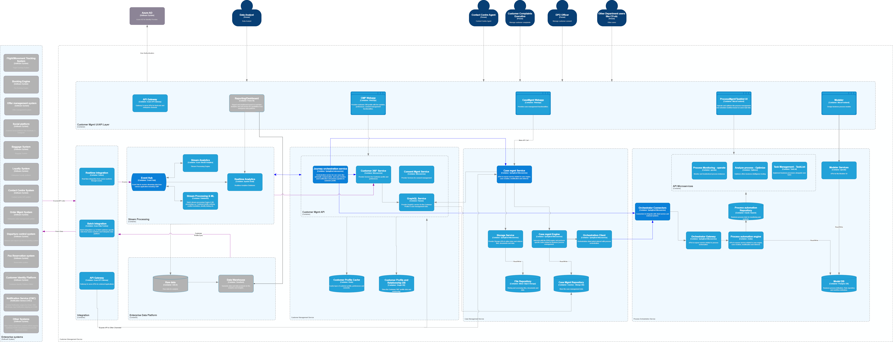

# Proposed Solution Architecture
The proposed solution architecture for CMP is organized around Architecture views and diagrams. Each view may be composed of one or more diagrams illustrating a specific area from a specific perspective.

## Architecture Vision

blah blah

## Guiding Principles

blah blah...

## Architecture Styles & Patterns

blah blah...

## Architecture Views

### Logical View

##### CMP Portal
The CMP portal is the UI layer for the Airline service agents and other key airline stakeholders to interact with the platform. This portal is **not** directly exposed to the Airline Customer. 

##### Gateway Services
The Gateway services layer provides the gateway functions such as Authentication, session management etc. This layer is focused on ensuring that the requests to the platform are secured the necessary authentication and authorization protocols are ensured.

##### Customer Mgmt. Services
This block is composed of the core Customer management capability of the platform. This layer exposes the key capabilities as APIs as well as Events for consumers of the Customer management services. 

##### Platform Services
This layer provides the foundational technology platform services to support eventing, AI/ML predictive & prescriptive analytics, Customer Data attribute management, process engines , business rules etc. The Customer management service relies a lot on the Platform services. 

##### Integration Services
This layer provides the integration services to the platform, which allows collecting data (Batch & Near real time) from the existing on-premise airline transactional systems, Enterprise data platform etc. as well as exposing the Customer management capabilities previously discussed.

##### Identity & Access Mgmt. (IAM) 
The IAM provides the Authentication & Authorization services for the whole platform. Since the CMP is accessed only by Service agents & the Airline stakeholders, this layer is only responsible for maintaining the Airline employee Identities.

##### Management & Monitoring
This layer provides the management & monitoring functions for the platform. Each component of the CMP provides a management & monitoring interface to integrate with this layer.

### Architecture Context

### Container Diagram

### Information Architecture

### Deployment Architecture

* New solution will be hosted on Azure cloud and the region will be chosen closer to the area of operation.
* Azure Express route exist between current on-premise data center and cloud provider.
* Azure eventhub will be used for eventing.
* Azure Open AI will be used for self-service, personalized recommendations and resolution options.

## Key Assumptions & Constraints

* Most of the Key operations systems can publish the requried events in realtime
* Customer Identity is managed in one central IDP (Okta)
* Customer Notification is managed through a central Notification Platform considering Corporate Communciation Standards
* Customer interactions will remain with the existing channels like Contact center, Booking Engine
* Enterprise Data Platform will own the data cleansing and dedupliction of the customer profile sources from various system
* DPO aggremement is available to capture & process social profile informaiton based on optional customer consent **
* Existing systems could either be on-premise or on cloud.
* Consent management notification from Customer Management Platform is expected to be respected and processed by all the systems in the landscape 
* New solution will be use existing enterprise logging solution
* New solution will follow the current monitoring and observability defined by enterprise.
* Existing enterprise defined security standards will be followed by the new solution.
* Compensation management will be handled by an existing system in the landscape.

