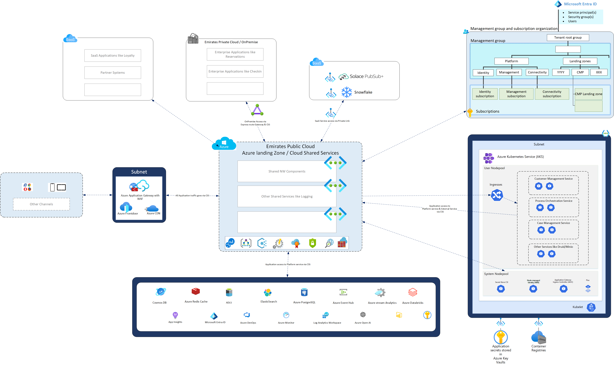

# Proposed Solution Architecture
The proposed solution architecture for CMP is organized around Architecture views and diagrams. Each view may be composed of one or more diagrams illustrating a specific area from a specific perspective.

## Guiding Principles

The following are key guiding principles for the proposed Architecture 

### General Architecture

| Principle                         | Rationale                                                    | Implications                                                 |
| :-------------------------------- | :----------------------------------------------------------- | :----------------------------------------------------------- |
| Simplicity | Simpler Architecture leads to simpler and well understood systems.| Development, implementation & maintenance of simpler systems is less expensive, in both time and other resources compared to complex systems|
| Abstraction | The use of abstraction allows design to be independent of the physical aspects of the system | Easier to understand and more flexible to implement & maintain|
| Modular               | Modular design enables components/services to be improved/replaced with ease. | Components/services can be tested/deployed with minimal business disruption. Improved availability and reliability. |
| Resilient | Resilient design ensure that the system is highly available and fault tolerant. For e.g no single part of a system can stop the entire from working| System components are designed & implemented with Failure-is-the-norm mindset along with necessary validation and enforcement engineering processes in place|
| Open & Standards based | Adopting Open standards & specifications where applicable enables a flexible and open system which allows future evolution| Avoids vendor lock-in, allows evolution and improves maintainability |
| Pattern based architecture        | Industry well recognised/proven pattern based architectures will improve re-usability | Less effort to build and maintain systems                    |
| Compliant with law and regulation | All solutions must be law-abiding and compile with rules and guidance from regulatory bodies | Rules of the road, just follow them!                         |

### Integration

| Principle                                        | Rationale                               | Implications                                                 |
| :----------------------------------------------- | :-------------------------------------- | :----------------------------------------------------------- |
| API first approach | API first approach ensures that the internal capabilities of a subsystem or service is open for evolution | Subsytems concepts and abstractions should be well thought out and meaningful for consuming applications / clients |
| Event Orientation | Reduces temporal dependencies between services which improves availability, reliability & extensibility characteristics of the system| All system components should publish relevent business and system events without worrying about which part of the system is consuming them| 

### Security

| Principle         | Rationale                                                    | Implications                                      |
| :---------------- | :----------------------------------------------------------- | :------------------------------------------------ |
| Zero Trust Architecture | Adopting Zero Trust design principles reduces the attach surface of the system and risk of data breach| Zero trust security principle implies that systems are designed with granular access controls and expects subjects to explicitly state the scope of acess required and do only what is applicable for the scope of access. |
| Secure from Start | Security is not a after thought. Security built into system and process design will provides more security for valuable business data. | Secured and protected organisation in digital era |

### Data
| Principle         | Rationale                                                    | Implications                                      |
| :---------------- | :----------------------------------------------------------- | :------------------------------------------------ |
| Data Quality | High quality data helps build accurate customer profiles and allows effective personalization features to be built| This principle implies that the design of system and features should be designed around reliable and high quality data feeds and events to provide effective personalization features |
|Data Governance | Effective Data governance allows data to be tracked from its original source through its journey till it has been processed and disposed off| Personal data of customers need to be designed with data governance and tools in mind aligning to the capability within the organization handling the customer data|

## Architecture Styles & Patterns
The key architectural styles and patterns used in the proposed architecture are 

| Style | Description | Rationale |
|---|---|---|
| Microservices | A microservices architecture is a type of application architecture where the application is developed as a collection of services. It provides the framework to develop, deploy, and maintain microservices architecture diagrams and services independently. | Microservices allow a large application to be separated into smaller independent parts, with each part having its own realm of responsibility. To serve a single user request, a microservices-based application can call on many internal microservices to compose its response.|
| Event Driven Architecture | An event-driven architecture uses events to trigger and communicate between decoupled services and is common in systems built with microservices. An event is a change in state, or an update, like an Flight departure or Baggage mishandled etc.| Event Driven architectures enable a loosely coupled system which improves availability, resilience, Fault tolerance & evolvability of a system |
| Lambda Architecture |Lambda architecture is a data deployment model for processing that consists of a traditional batch data pipeline and a fast streaming data pipeline for handling real-time data. In addition to the batch layer and speed layers, Lambda architecture also includes a data serving layer for responding to user queries. This hybrid approach is designed to harness enormous volumes of rapidly created data, enabling businesses to make use of data more quickly | Existing customer transactional data could be amounting to tera or peta bytes which require batch processing. In addition the CMP usecase needs to react to operational events in near-realtime which require stream processing hence the Lambda Architecture is a good fit for the CMP for building a customer 360 degree view |
| Reactive Architecture | Reactive architecture patterns are a set of design patterns that aim to build systems that are responsive, resilient, elastic, and message-driven.  | These patterns are particularly useful in distributed systems that deal with a large volume of data and high concurrency |

## Architecture Views

### Logical View

##### CMP Portal
The CMP portal is the UI layer for the Airline service agents and other key airline stakeholders to interact with the platform. This portal is **not** directly exposed to the Airline Customer. 

##### Gateway Services
The Gateway services layer provides the gateway functions such as Authentication, session management etc. This layer is focused on ensuring that the requests to the platform are secured the necessary authentication and authorization protocols are ensured.

##### Customer Mgmt. Services
This block is composed of the core Customer management capability of the platform. This layer exposes the key capabilities as APIs as well as Events for consumers of the Customer management services. 

##### Platform Services
This layer provides the foundational technology platform services to support eventing, AI/ML predictive & prescriptive analytics, Customer Data attribute management, process engines , business rules etc. The Customer management service relies a lot on the Platform services. 

##### Integration Services
This layer provides the integration services to the platform, which allows collecting data (Batch & Near real time) from the existing on-premise airline transactional systems, Enterprise data platform etc. as well as exposing the Customer management capabilities previously discussed.

##### Identity & Access Mgmt. (IAM) 
The IAM provides the Authentication & Authorization services for the whole platform. Since the CMP is accessed only by Service agents & the Airline stakeholders, this layer is only responsible for maintaining the Airline employee Identities.

##### Management & Monitoring
This layer provides the management & monitoring functions for the platform. Each component of the CMP provides a management & monitoring interface to integrate with this layer.

### Architecture Context

### Container Diagram

### Information Architecture

* “System of Record” for EK Customer information will be Customer Management Platform, sourcing information various customer touchpoints/systems
* Customer Profile and preference one view will be shown in CMP as well as exposed as API via API gateway
* Solace will be used for Realtime integration with other enterpise system and it will be bridged with Azure Event Hub 
* Azure Data Factory will be used for all Batch integrations

### Deployment Architecture

* The new system will be deployed on Microsoft's Azure cloud platform. We will leverage Azure Platform Services like Azure Kubernetes Service and Azure Postgres which are independent of the Azure-specific environment to avoid vendor locking
* The application will be available in multiple regions, with the primary region being selected based on proximity to the operational area. Within each region, the application will be distributed across multipe Availability Zones for enhanced resilience.
* For orchestrating microservices, we will utilize Azure Kubernetes Service. These microservices will be developed using Spring Boot (Reactive Stack).
* The Hasura GraphQL Engine will used.
* To address caching needs across the application, Azure Redis Cache will be used.
* For event streaming, Azure Event Hub is the chosen platform, complemented by Azure Stream Analytics for stream processing. Azure Databricks will be employed for both batch stream processing and machine learning tasks.
* For real-time analytics, Apache Druid is selected, and Power BI will be used for reporting, drawing data from Snowflake and Apache Druid.
* For orchestrating customer journeys, we will use a Journey Orchestrator Microservice. Complex orchestrations requiring greater flexibility will be handled by the Camunda Process Orchestration Engine as extension to Journey Orchestrator Microservice.
* Customer profiles, along with its relatioships such as bookings, flights, and baggage, will be stored in the Azure Cosmos graph DB.
* FormIO will serve as the case management form designer and Case data will be stored in Azure Cosmos DB with MongoDB API compatibility
* Process Orchestration Engine will utilize Managed Elasticsearch. The process models for orchestration will be stored in a Managed PostgreSQL Database.
* API security will be maintained using OAuth, with Azure Application Gateway, including a Web Application Firewall (WAF), managing API access. Solace will facilitate real-time integration with other enterprise systems, bridging with Azure Event Hub for this purpose. Azure Data Factory will handle all batch integrations.
* Azure ExpressRoute will be used for secure, reliable connectivity to on-premise data centers.

### Security Architecture

* Security at Rest will be enabled on all the data repository like Azure Cosmos, Azure PostgreSQL, ADLS
* Security in Transit will be enabled using TLS
* Microsoft Entra Identity (formerly Azure Active Directory) serves as the central identity management system for users, service principals, and security groups.
* The Azure Web Application Firewall (WAF) and the Enterprise Firewall within the Cloud Shared Service provide protection for incoming and outgoing traffic.
* Traffic to and from every Virtual Network (VNet) is routed through the Cloud Shared Service VNet, specifically via the Enterprise Firewall.
* Azure Network Watcher and Log Analytics enhance security monitoring by integrating network traffic logs with other log data to identify potential security incidents or breaches.
* All APIs are secured using OAuth and are made available through the Azure Application Gateway, which includes a Web Application Firewall (WAF).
* Only essential ports are open to Azure Platform services such as EventHub and CosmosDB, and these are further safeguarded with client IP filtering and Security Groups in the firewall.
* Azure Virtual Networks and subnets are employed to provide logical isolation for all workloads.
* Azure Private Link is utilized for secure access to Software as a Service (SaaS) offerings like Solace and Snowflake.
* Azure Key Vault is implemented for the storage and management of security keys

### Technical Stack

|  | Technical Stack  |
| ------- | --- |
| Front End | React JS 18.x , Webpack 5 (Microfront End )|
| Back End | Spring Boot 3 (Reactive), JDK 17 |
| API Gateway | Azure APIM |
| Container orchestration | Azure Kubernetes Service |
| Database / Repository | Azure Cosmos (Graph) for Customer Profile, Azure Cosmos (Mongo) for Case Management, Azure PostgreSQL for Process Model, ADLS for Raw Data Storage, Elastic search for Orcherstation Engine, Minio for Files |
| Event Streaming | Azure Event Hub |
| Stream Processing | Azure Stream Analytics |
| Stream Batch Processing & ML | Azure DataBricks |
| Realtime Analytics | Apache Druid |
| GraphQL Engine | Hasura |
| Reporting Service | Power BI |
| Data Warehouse | Snowflake |
| Process Orcherstation Engine | Camunda |
| Integration Platform | Solace (Realtime e.g. Events from Onpremise Enterprise application), Azure Data Factory (All Batch integrations), Azure APIM (on Demand Interface e.g. Consent Service, Customer 360 Service) |
| Logging | Splunk (SIEM), Log Analytics workspace |
| Application Performance Monitoring | Azure App Insights |
| Tracing | -Micrometer Tracing |
| Authentication and Authorisation | Microsoft Entra ID to be used for authentication using MSAL for React and Spring Azure  |
| Cache  | Azure Redis Cache |
| CDN | Azure CDN |
| Network Routing | Azure Frontdoor |
| DNS | Azure DNS |
| LLM | Azure Open AI |
| Connectivity to OnPremise | Azure Express route |

### Key Non Functional Requirements 

|  |   |
| ------- | --- |
| Availablity % | ***|
|  | ***|
|  | ***|

### Key fitness functions 

|  |   |
| ------- | --- |
| Customer Profile Request per second | ***|
| Customer Profile update events | ***|
|  | ***|

## Key Assumptions & Constraints

* Most of the Key operations systems can publish the requried events in realtime
* Customer Identity is managed in one central IDP (Okta)
* Customer Notification is managed through a central Notification Platform considering Corporate Communciation Standards
* Customer interactions will remain with the existing channels like Contact center, Booking Engine
* Enterprise Data Platform will own the data cleansing and dedupliction of the customer profile sources from various system
* DPO aggremement is available to capture & process social profile informaiton based on optional customer consent **
* Existing systems could either be on-premise or on cloud.
* Consent management notification from Customer Management Platform is expected to be respected and processed by all the systems in the landscape 
* New solution will be use existing enterprise logging solution
* New solution will follow the current monitoring and observability defined by enterprise.
* Existing enterprise defined security standards will be followed by the new solution e.g. Zero Trust Policy
* Payment processing and refunds will be handled by an existing system in the landscape.
* Enterprise Knowledge Management has ability to expose the content via proper interface for training in Open AI 

